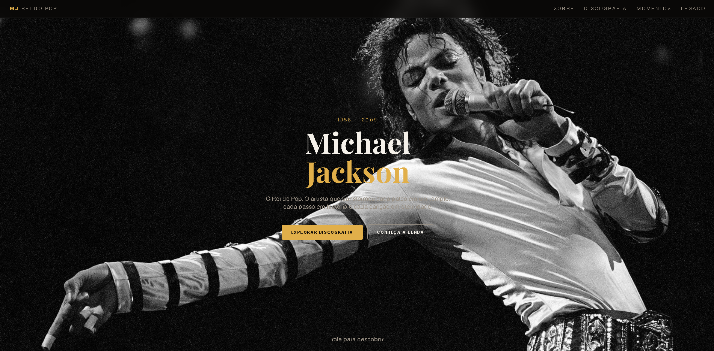
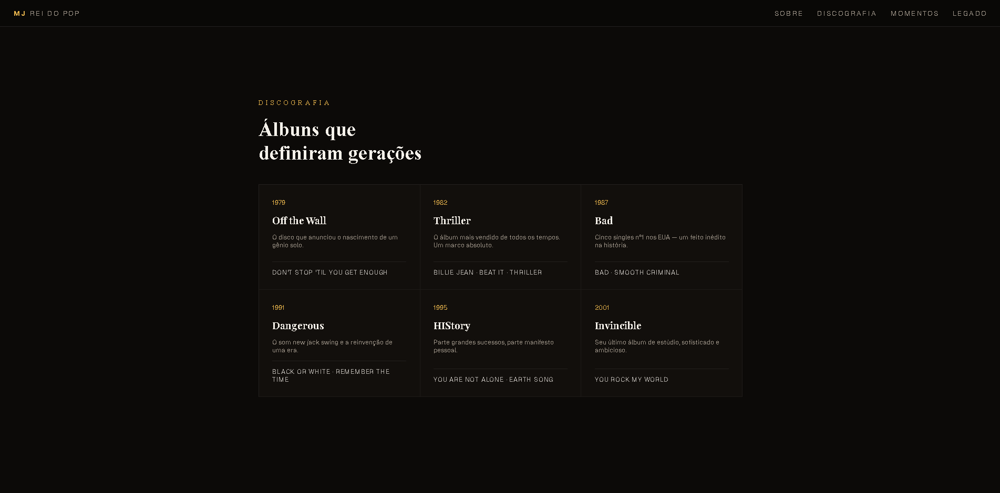

# Michael Jackson Tribute

Uma landing page responsiva e visualmente impactante em homenagem ao legado de Michael Jackson, desenvolvida com React, Vite e Styled Components.

## Overview

Este projeto foi criado para celebrar a trajetória artística de Michael Jackson por meio de uma experiência visual envolvente, com destaque para:

- sua história e impacto cultural
- sua discografia icônica
- momentos marcantes da carreira
- um design moderno e temático

## Screenshots

Adicione as imagens do projeto na pasta public/images e substitua os exemplos abaixo:






### Mobile Preview

Uma captura do site em modo mobile ou tablet pode ser colocada aqui para demonstrar a experiência responsiva:

<p align="center">
  
</p>

## Features

- Layout responsivo
- Navegação entre seções
- Interface moderna e temática
- Destaque para álbuns, performances e legado
- Estrutura organizada para manutenção

## Tech Stack

- React
- Vite
- Styled Components
- JavaScript
- ESLint

## Getting Started

### Prerequisites

- Node.js
- npm

### Installation

```bash
git clone <url-do-repositorio>
cd michael-jackson-tribute
npm install
```

### Run locally

```bash
npm run dev
```

### Build for production

```bash
npm run build
```

## Project Structure

```bash
src/
├── assets/
├── pages/
│   └── home/
│       ├── App.jsx
│       └── styles.js
```

## Author

Desenvolvido como um tributo visual e artístico ao legado de Michael Jackson.
